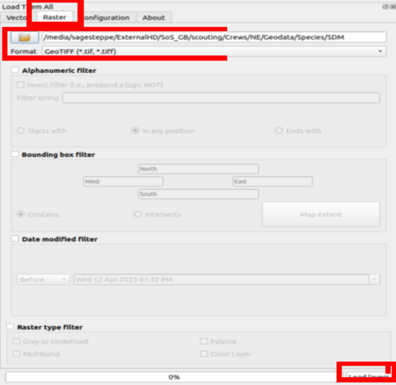

# QGIS Lesson
This repository contains contents for teaching SoS crews how to set up and interact with the open source, lightweight, and efficient geographic information system (GIS) QGIS.

# Background:

A **Geographic Information System** (GIS) is a system that is used for displaying, analyzing, and in part distributing data which have geographic attributes. As of the last few decades, GIS are nearly synonymous with computers, although they predate them. Several different GIS softwares exist. The most popular are generally: R, Python, GrassGIS, SagaGIS, QGIS, and ArcGIS - which is being superseded by ArcPro. The 'Arc' line of products are produced by the company ESRI, and are very popular in multiple tiers of government in the United States (e.g. city, county, state, and federal). The other Geographic Information Systems are very popular in academic settings (Universities, or the Research Divisions of Government Agencies like the USGS), and worldwide. Most of these earlier systems are all Open-source, which means individuals and organization are able to contribute code to improve their performance for certain applications. Most of these other GIS software compose a ecosystem, where some rely on others. 

QGIS is arguably the most common GIS in the open source ecosystem with a **Graphical User Interface**. Many appreciate that it is 'light', i.e. it does not take up enormous computer resources which allows it to load very fast and be responsive to users panning and toggling around the map. We will use QGIS as a supplement to the ESRI Geoplatform product. This is simply due to the fact that we have generated a ton of data which I do not have access to add back to the BLM servers! Such is government. 


## Installation 


Normally, I would not ask you to install GIS software on your computer; but due to being so 'light' QGIS is the exception. QGIS can be downloaded from [here](https://www.qgis.org/en/site/forusers/download.html), for all major operating systems: Windows, Mac, and several flavors of Linux. 

**Windows** users are **unlikely** to need the OSGeo4W installer; although it is a small efficient piece of software which does not take up much room. It might be safer to download than be sorry if you want to keep using this in the not so near future!

**Mac** "macOS High Sierra (10.13) or newer is required. QGIS is not yet notarized as required by macOS Catalina (10.15) security rules. On first launch, please control-click on the icon and choose Open from the context menu, after which a confirmation dialog is shown and you need to click the Open button."

There is a common problem on Macintosh that the security ticket from QGIS is not recognized. This should have been fixed a long time ago, but [this post](https://github.com/qgis/QGIS/issues/34018) details how to bypass security to allow usage of QGIS.  To do this:
**Apple Menu**  > **System Settings**, then click **Privacy & Security** . In the lower half of this window you should see a message similar to:
"QGIS3.10 can't be opened because Apple cannot check it for malware" click **Open anyways** and then, if another window pops up **open**. QGIS shoult now be on your approved list of software and you now be able to open it as needed! 

**Linux** please refer to [this](https://www.qgis.org/en/site/forusers/alldownloads.html#linux) additional page on installation 

Great that is about it! It is a quick install! Once downloaded navigate to the program, and if necessary feel free to pin it to your start bar or something so you don't forget about it!


Part of why QGIS is so light it that it does not come with many interfaces to the other open-source software which some folks may use. You download these using **Plugins**. We will install two Plugins. Open QGIS, if it is not already, and navigate to the **Plugins** tab on the top bar and **Plugins >> Manage and Install Plugins**. From this pop-up screen use the **Search** bar at top to search for **QuickMapServices**. We will use this Plugin to display base maps. Now let's add one more Plugin, using the **Search** bar search for **Load Them All**. We will use this service to import many files quickly. 


That's it! We now have an operational GIS on our hands!

## Gather your project specific data

You all should have a folder of data [here](https://github.com/sagesteppe/QGIS_Lesson/tree/main/data) **UPDATE FOR PRIVACY REASONS EMAIL REED FOR ACCESS TO THESE**.  The drive should have a **zip** file; this is a formatting for compressing data which makes it easier to send. Please download this file. To do this click on YOURCREW-Geodata.zip, and then the download button to the right (scroll down to the bottom of this section for an image of this button highlighted). Once downloaded (or if you have the change to before), please drag this to your project specific folder for Seeds of Success this year. A good place to put this folder, if you do not already have it, is in your **Documents**. From this location you can unzip the folder. On most software systems you can right click the file, and select an option like **decompress**. This folder contains a ton of supplemental project data. Most importantly it contains **Species Distribution Models** (SDMs), we generated species distribution models for all but two of the Great Basin Ecoregion Target Species. We skipped these two because you will have no difficulty finding them! If you would like to learn more about SDM's please visit [this lecture](https://rpubs.com/steppe27/1006352) I recently gave. This folder also contains occurrence data for the species, a subset of the records here are identical to those on the tablet, but we have several times more! We used this large dataset of occurrences to create our Species Distribution Models. 

The only other data sets we have which are not present on the tablet are some data on **Drought**, **Invasives annual grasses**. If you are interested in learning more about Ecological Drought check out this section of a big ol' government report [here](https://github.com/sagesteppe/UFO_drought/blob/main/scripts/Section_6.pdf), and some more good info on invasive species from the same report can be found [here](https://github.com/sagesteppe/UFO_noxious_weeds/blob/main/scripts/Section_10.pdf). Cool! So while these data are very similar to what is on the tablet, we have a few more tricks up our sleeves as you will see. 

Now we are also going to download some data that contains pre-specified aesthetics for our project. Let's be honest, this should style automatically, but I hardly ever use GUI GIS software, so I just don't know how to do that! Normally it sucks to suck, but I am just going to make you all have to map the aesthetics over yourselves!! So ya!

Download the zip file 'qml_styles' from [here](https://github.com/sagesteppe/QGIS_Lesson/data/qml_styles/qml_styles.zip), and click the little 'download' button. Place this in the same directory as above, and remember to unzip it. 


## Create a QGIS Project

Many GIS operate on the sense of a **project** a big related set of objects for each thing you are working on. We will create a **Project** for your SoS-Planning. The easy way to do this is to **close** QGIS (if it is open), and reopen it, and click on **'New Project'**, if you already have a project than click **Project >> New**. You have now entered a new Project, now let's save this at the **root** of your Geodata folder. 


```
.
└── Geodata
    ├── Admin
    │   ├── Boundaries
    │   └── Surface
    ├── Disturb
    │   ├── Fire
    │   └── Invasive
    ├── Drought
    ├── Roads
    ├── Species
    │   ├── Historic_SoS
    │   ├── Occurrences
    │   └── SDM
    └── STZ
```

If you are unfamiliar with the **root**, it is the base of something! So if we look in the geodata folder, and think of it as the soil, we have 'Admin', 'Disturb', 'Drought', 'Roads', 'Species' and 'STZ' all rooted in it! So let's save your project in 'Geodata'

```
.
└── Geodata
    ├── Admin
    │   ├── Boundaries
    │   └── Surface
    ├── Disturb
    │   ├── Fire
    │   └── Invasive
    ├── Drought
    ├── Roads
    ├── Species
    │   ├── Historic_SoS
    │   ├── Occurrences
    │   └── SDM
    └── STZ
    |__ SoS-Planning.qgz # this is now rooted in the geodata directory!!!
```

the root of a specific projects directory is:


## Import data to QGIS

We are now ready to import data to our QGIS project, it looks a little sad without any content doesn't it? First let's add in a basemap so that we are oriented. We will use the **QuickMapServices** Plugin which we just installed. This Plugin is generally located on the right end of your toolbar. It looks like a globe with binoculars. 


Once you have located it, we will use it to import the standard basemap which it ships with, **OSM >> OSM Standard**. This imports a freely available base map tile service. Cool!


Now we will import our two big sets of data, our **Species Distribution Models**, and the **occurrence** data we used to create them. These are most complex imports, so we will do them before we have a chance to mess up the project and need to revert back!

https://user-images.githubusercontent.com/62572330/231841827-b28abb00-aff3-42be-8813-43a2a6c8ddb1.mp4

We will utilize our other plugin **Load them all**, load them all looks like a folder with a green arrow coming down from it, like the folder is being opened. So click on that! Now make sure that the leftmost option, **Vector**, is toggled. Vector data are what sometimes are called 'shapefiles', shapefiles are a specific type of vector data, but not all vector data are shapefiles!!! If you are unfamiliar with geographic data formats, check out a lecture on the topic [here](). We will now navigate to the to the folder containing your geodata **'Geodata/Species/Occurrences'**, and select the file format **ESRI Shapefile (*.shp)** there should be somewhere from around 30-50 files showing in that location. Now at the very bottom right of this window select 'Load Data'. 

Ok now the occurrence data are imported! We are going to turn these into a **Group**, a set of data which we can manage simultaneously. To create a **Group** right click on the top-most record scroll down to the very last record, and right click again while holding shift. With any luck every record will now be selected! Now on this menu select **'Create Group'**, and let's name this group **Occurrence**. 

https://user-images.githubusercontent.com/62572330/231843778-76bd0eaa-066b-448b-96c0-b64ed32543d3.mp4

We will style these data now quickly. Because well, they are uninformative, and data which are uninformative are not worth much. We will load some pre-loading styles I came up with using [Colorbrewer](https://colorbrewer2.org/#type=sequential&scheme=BuGn&n=3), hopefully they look okay. Right click on the top-most record, it is probably *Achnatherum lemmonii*, and select **'Properties'** and then **Style >> Load Style**, now navigate to the **qml_styles** directory, and select the **Occurrences.qml** file. Now **Apply** and **OK** this selection. 

https://user-images.githubusercontent.com/62572330/231844207-5b512126-f423-47ec-b8c3-782cdec1daa0.mp4

You might not even be able to see what we did there... Let's turn of all of the records in our **Occurrence** group really quick. Right click on the group, and select **Uncheck and all it's children**, now just check the little cell next to the record you added the stylings to, maybe *Achnatherum lemmonii*, OK see what we did? If not you might need to **Right Click >> Zoom to layer**; now you should be focused on these records. Keep in mind for you field offices there could only be 1 record! 

Now, let's apply this styling to every species in our Occurrence group. Click on the name of the top-most record and **Style >> Copy Style >> Symbology**, and now **right click >> Paste style**. If all goes to plan, each species will have the same symbology!

But wait... why? Why should each species be the same color! This makes no sense!!! So, the way we came up with this stuff is using a lot of code and approaches from a technique called **'Data Science'**, I'm sure you have heard these term, there is a lot of hype around it. One of the fundamental rules of data science is **don't get overwhelmed by data**. So I seriously, suggest, that you look through each species one at a time! Yep... more on this later. You will also notice that their are several sets of symbology within this layer; the older a record the lighter the color; you will also notice you can deselect old records? Why, because many of those old populations may no longer exist; we want to use current data. 


Now if that all went to plan, let's **save** our project! Now we can add in the **SDMs**

### Add in Species Distribution Models

A very similar process is used to the bulk importing of Species Distribution Models as for the raw occurrence data. 

We will need to select the second tab on the **Load them all** plugin pop-up window, the one that says **"Raster"**. We will the redirect the path to the **SDM**
 directory and switch the filetype to **GeoTIFF .tif, .tiff**. Now you can load the data again. They should also be **grouped** and have their styles added to them in the same way as the occurrence data. 
 


### Add in remaining variables

The remaining variables only have at most two layers (for drought), and so they are simple to import. There are a few schools of thought on this but I just go into the folders, like you would when normally navigating a computer and drag and drop the datasets in. The remaining datasets are:

```
├── Admin
│   ├── Boundaries
│   │   ├── Field_Office_Boundaries.shp
│   └── Surface
│       ├── BLM_Surface.shp
│       ├── USFS_Surface.shp
├── Disturb
│   ├── Fire
│   │   ├── Fire.shp
│   └── Invasive
│       └── Invasive.tif
├── Drought
│   ├── drought-12.tif
│   ├── drought-6.tif
├── Roads
│   ├── roads.shp
├── SoS-Planning.qgz
├── Species
│   ├── Historic_SoS
│   │   ├── Historic_SoS.shp
│   ├── Occurrences
└── STZ
    ├── STZ.shp

```

Note that you only need to drag the 'shp' file into QGIS, it uses the others, but will figure them out once the '.shp' file is dropped in. All of these layers contain style (qml) files which have identical, or near identical names to them. 

## Simple digital scouting example

Some of the layers are kind of redundant and some will require only cursory glances at. For example, the 'Drought' layers are oftentimes pretty similar, and easy to interpret. Anywhere that is not in negative values is great to collect from! And theoretically the bluer, the area the more seeds. But don't worry too much about trying to maximize this. 


https://user-images.githubusercontent.com/62572330/231854875-57b43428-c095-48fc-b584-60d1f485bbc0.mp4


Speaking of drought, because the moisture has been pretty good this season, it is a good year to collect from some of the dried Seed Transfer zones, I have added them in. If we toggle this on and off, you will notice there are some small patches of land which are **not** colored, these zones are NO GO's! They are too small and it is **not** desirable to collect seed from them. Depending on where you are working, BLM may not really have any land in them anways! 


https://user-images.githubusercontent.com/62572330/231854714-40c55820-8dda-452c-b285-7b2e39296c46.mp4


We can readily look at the relationships of Fire and Invasive annual grasses here. Note that historic fires beg fires to re-occurr, this is common, and that these areas often have the highest amount of invasive species! Hmmm....! You'll hear alot about this this year! Essentially these annual invasives have totally altered the fire-cycle and are caught in a positive (for them...) feedback loop!


https://user-images.githubusercontent.com/62572330/231844375-50812820-920a-429d-a4da-ea275a8b0eb6.mp4


Finally, we can show how to focus on a single species to look at some prospective areas for scouting. Here we will add the occurrence records, by time period, and then add on the Species Distribution Models. As you can see occurrence records explode since the millenium, this is largely due to the implmentation of the AIM program around 2010. The SDM has been categorized into 5 classes, the first - which you cannot see, is highly unsuitable habitat. The next four levels go from 1-4, and indicate increasingly suitable habitat. Classes 3 and 4 are very suitable and ideal, respectively. 


https://user-images.githubusercontent.com/62572330/231861285-b70d2528-882b-4619-b075-65b272e70268.mp4


Now we can use some relevant layers to look for some areas which like promising scouting locations. Most all of these areas look pretty good! Although the lower left most looks pretty close to private, and deserves closer investigation. The furthest right most population looks pretty far off the beaten path, and the road conditions to it should be investigated; if things don't pan out at the populations near the major roads it is worth asking BLM staff about conditions out that way. 

https://user-images.githubusercontent.com/62572330/231862471-72b0349f-afe2-44a7-8419-9996d782ce14.mp4


Here I have drawn some simple yellow boxes around a few of these candidate areas. 


There are many different ways to get to these. Which one you choose is pretty personal. An old-timer like me will grab the coordinates, mark them in a physical road atlas, and navigate to them using that, using BLM 1:100 topos as required. But, your tablets provide excellent alternatives!!! For example you can drop pins to these in there, or even select the AIM plot records!!! 


Anyways, hopefully you have QGIS set up now, and you can start finding scouting populations one species at a time! Whether you record locations in road atlases, tablets, or whatever else, we encourage you to put them on a spreadsheet. Then you have a record of what looks promising, and we expect you to record the fate of each of these scouting events to the tablet! After a few scouting hitches, you will then be able to switch exclusively to geo-platform for your collection revisits!!

## recording digital scouting info to form a hitch plan from


The above example is a good way to start focusing on species and to keep track of your upcoming hitch (or maybe one far off in the distance depending on when the species flowers). You can more or less group points onto the same day as each other for scouting. 

A tracking spreadsheet like this will also allow you to create a hitch plan very quickly. We want you to make hitch plans so that we have an idea of where you are in the field! While these can be pretty complex for some jobs, our requirements are pretty minimal; and we want them to be useful to *you* and not entirely an obligation. 


Also add a simple **screenshot** of the general area(s) you plan on going. 


the above image is more than enough detail, and if you look closely you will see it contains some of the named roads. (you can turn road names on in QGIS via **right clicking** the 'roads' data set, and then **show labels**;  show labels is about the fifth item down on the pop up; but bear in mind, most BLM roads are unnamed, so you may need to zoom out to see if it's working!).

Once you return from your hitch you can add some more tracking info to the sheet. I think the easiest solution is to mostly just link the population back to the scouted point, and copy out the pieces of info which you think you will need to remember to go back to the plot using the tablet!


